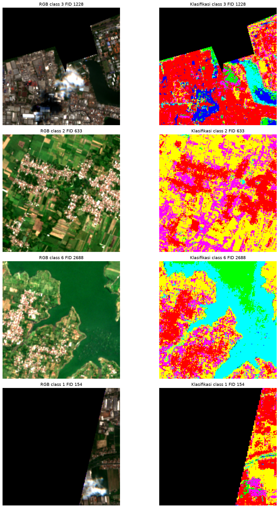
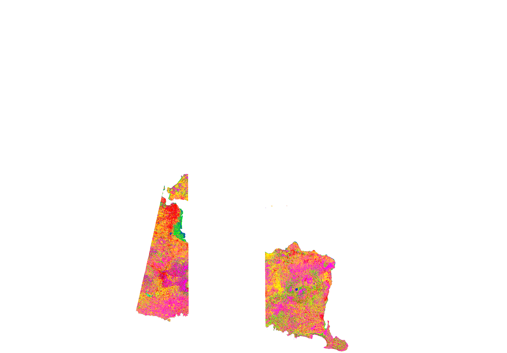
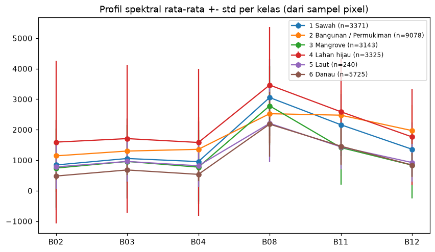
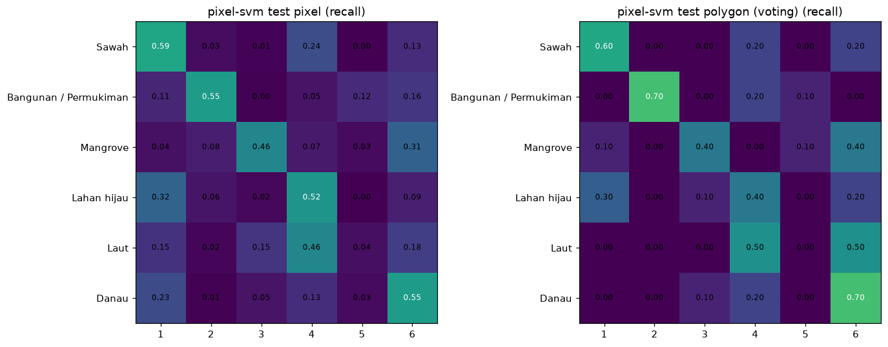

<div align="center">

# 🛰️ Klasifikasi Penggunaan & Penutupan Lahan Jawa Timur

### dari citra **Sentinel-2** → 6 kelas tutupan lahan → peta interaktif & dashboard

<p>


</p>

<a href="https://rahardian-ananta-psd-klasifikasi-lahan-app-bs77za.streamlit.app/">
  
</a>
&nbsp;
<a href="https://rahardian-ananta.github.io/PSD-Klasifikasi-Lahan">
  
</a>

</div>

---

## 🌏 Apa ini?

Proyek *end-to-end* klasifikasi **penggunaan/penutupan lahan Jawa Timur** dari citra satelit **Sentinel-2**.
Mulai dari pengambilan data, rekayasa fitur spektral, pelatihan & perbandingan **10 model**, evaluasi
yang jujur (validasi silang berbasis poligon, bukan pixel acak), hingga **peta klasifikasi 6 kelas**
dan **dashboard interaktif** yang bisa dicoba siapa saja.

> **6 kelas:** 🌾 Sawah · 🏙️ Bangunan/Permukiman · 🌿 Mangrove · 🍃 Lahan hijau · 🌊 Laut · 💧 Danau

<table>
<tr>
<td width="50%"><br><em>Citra RGB (kiri) vs hasil klasifikasi (kanan)</em></td>
<td width="50%"><br><em>Overlay peta klasifikasi di atas batas administrasi</em></td>
</tr>
</table>

---

## ✨ Yang bikin proyek ini menarik

- 🛰️ **Data nyata** — Sentinel-2 wilayah Jawa Timur (band B02–B12) + batas administrasi.
- 🧪 **10 model dibandingkan apples-to-apples** — 2 representasi fitur (per-pixel & rata-rata poligon) × 5 algoritma (RF, Extra Trees, LightGBM, SVM-RBF, Logistic Regression).
- 🧠 **Split anti-bocor** — pemisahan berbasis **poligon (FID)**, bukan pixel acak, sehingga skor tidak “kebocoran” antar area bertetangga.
- 📏 **Evaluasi jujur** — Macro-F1, bootstrap CI, confusion matrix, dan CV `StratifiedGroupKFold` (group = poligon).
- 🗺️ **Peta akhir 44 MB** hasil inferensi `pixel-RF` di seluruh area kajian → 6 kelas.
- 📊 **Dashboard Streamlit 7 halaman** — dari ringkasan, alur data→model, peta interaktif, luas per kelas, evaluasi, unduh model, sampai metodologi.
- 📖 **Jupyter Book** — laporan lengkap Bab 1–6 yang otomatis terbit ke GitHub Pages.
- 🔁 **CI/CD** — GitHub Actions membangun & menerbitkan laporan tiap kali `main` di-push.

---

## 📊 Hasil

Model terbaik menurut validasi silang adalah **SVM (fitur per-pixel)**, dengan **Macro-F1 poligon ≈ 0,54**.
Untuk membuat peta dipakai **Random Forest** karena kualitas serupa namun jauh lebih cepat saat inferensi.

| Representasi | Model | CV Macro-F1 | Test Macro-F1 (poligon) |
|:--|:--|--:|--:|
| **pixel** | **SVM (RBF)** ⭐ | **0,521** | **0,474** |
| pixel | LightGBM | 0,517 | 0,450 |
| pixel | Extra Trees | 0,505 | 0,447 |
| pixel | Random Forest 🗺️ | 0,501 | 0,465 |
| pixel | Logistic Regression | 0,331 | 0,391 |
| mean | Logistic Regression | 0,422 | 0,466 |
| mean | Random Forest | 0,437 | 0,444 |
| mean | Extra Trees | 0,440 | 0,404 |
| mean | LightGBM | 0,418 | 0,450 |
| mean | SVM (RBF) | 0,416 | 0,444 |

> ⚠️ **Catatan jujur:** skor berkisar ~0,45–0,54 karena beberapa kelas (mis. *Sawah* vs *Lahan hijau*, *Bangunan* vs jalan) memang **tumpang tindih secara spektral** pada resolusi Sentinel-2. Ini batas data, bukan bug kode — dan justru itu yang dibahas detail di laporan.

<table>
<tr>
<td width="50%"><br><em>Profil spektral tiap kelas</em></td>
<td width="50%"><br><em>Confusion matrix model terbaik</em></td>
</tr>
</table>

### 🧮 Luas per kelas (hasil inferensi seluruh area)

| Kelas | Luas (ha) | Porsi |
|:--|--:|--:|
| 🌾 Sawah | 526.208 | 36,72% |
| 🍃 Lahan hijau | 473.515 | 33,05% |
| 🏙️ Bangunan / Permukiman | 257.855 | 18,00% |
| 🌿 Mangrove | 134.224 | 9,37% |
| 💧 Danau | 26.824 | 1,87% |
| 🌊 Laut | 14.256 | 0,99% |

---

## 🗂️ Struktur Proyek

```text
PSD-Klasifikasi-Lahan/
├── app.py                     # Dashboard Streamlit (7 halaman)
├── requirements.txt           # Dependensi aplikasi
├── _config.yml / _toc.yml      # Konfigurasi & daftar isi Jupyter Book
├── intro.md · deployment.md    # Beranda & bab deployment
├── notebooks/
│   ├── 01_business_understanding.ipynb
│   ├── 02_data_understanding.ipynb
│   ├── 03_data_preprocessing.ipynb
│   ├── 04_modeling.ipynb
│   ├── 05_evaluation.ipynb
│   └── 06_webgis.ipynb
├── data/                      # Boundary & sampel latih (GeoJSON/GPKG)
├── outputs/
│   ├── figures/               # Peta, confusion matrix, grafik
│   ├── models/                # 10 model + best_model.pkl (+ metadata.json)
│   ├── raster/                # Peta klasifikasi akhir (.tif)
│   └── tables/                # Metrik, luas, split, CV (CSV)
└── .github/workflows/
    └── deploy-book.yml         # Build & deploy Jupyter Book ke Pages
```

---

## 🚀 Jalankan di Lokal

**Dashboard Streamlit**

```bash
pip install -r requirements.txt
streamlit run app.py
```

**Laporan Jupyter Book**

```bash
pip install "jupyter-book==1.0.3"
jupyter-book build .          # hasil di _build/html/index.html
```

---

## 🧠 Detail Teknis

| Aspek | Keterangan |
|:--|:--|
| **Data** | Sentinel-2 (L2A), 9 fitur: `B02 B03 B04 B08 B11 B12` + indeks `NDVI`, `NDWI`, `NDBI` |
| **Indeks** | `NDVI=(B08−B04)/(B08+B04)` · `NDWI=(B03−B08)/(B03+B08)` · `NDBI=(B11−B08)/(B11+B08)` |
| **Sampel** | **51.508** pixel (latih 40.076 / uji 11.432) dari 256 poligon (204/52) |
| **Split** | Berbasis poligon (`FID`), `stratify=class_id`, `random_state=42`, irisan FID = 0 |
| **Validasi** | `StratifiedGroupKFold`, group = `FID` (5 fold) |
| **Algoritma** | Random Forest, Extra Trees, LightGBM, SVM-RBF, Logistic Regression |
| **Inferensi** | `pixel-RF` → peta 6 kelas (`uint8`, nodata `0`) |
| **Stack** | Python, scikit-learn, LightGBM, rasterio, GeoPandas, Shapely, Folium, Streamlit, Jupyter Book |

**Kenapa SVM menang tipis?** Batas antar kelas **tidak linier**, sehingga model *kernel* dan *tree ensemble*
unggul jauh dibanding regresi logistik. SVM menang sedikit di CV tetapi \~3× lebih lambat saat inferensi —
karena itu peta dibuat dengan Random Forest (selisih kualitas masih dalam batas *noise*).

---

## ☁️ Deployment

| Bagian | Platform | Status |
|:--|:--|:--:|
| 🖥️ Dashboard | Streamlit Community Cloud | [**Live**](https://rahardian-ananta-psd-klasifikasi-lahan-app-bs77za.streamlit.app/) |
| 📖 Laporan | GitHub Pages (Jupyter Book) | [**Live**](https://rahardian-ananta.github.io/PSD-Klasifikasi-Lahan) |

Model besar (`pixel_rf.pkl`/`random_forest_best.pkl` ~0,5 GB, `pixel_et.pkl` ~1,3 GB) **tidak** ikut ke repo
karena melebihi batas GitHub; aplikasi hanya membutuhkan `pixel_svm.pkl` (~1 MB). Lihat `deployment.md` untuk detail.

---

<div align="center">

**Dibuat dengan ❤️, ☕, dan banyak 🛰️** — proyek *Penambangan & Sains Data*.

<sub>© 2026 Rahardian Ananta · Data: ESA Copernicus Sentinel-2</sub>

</div>
